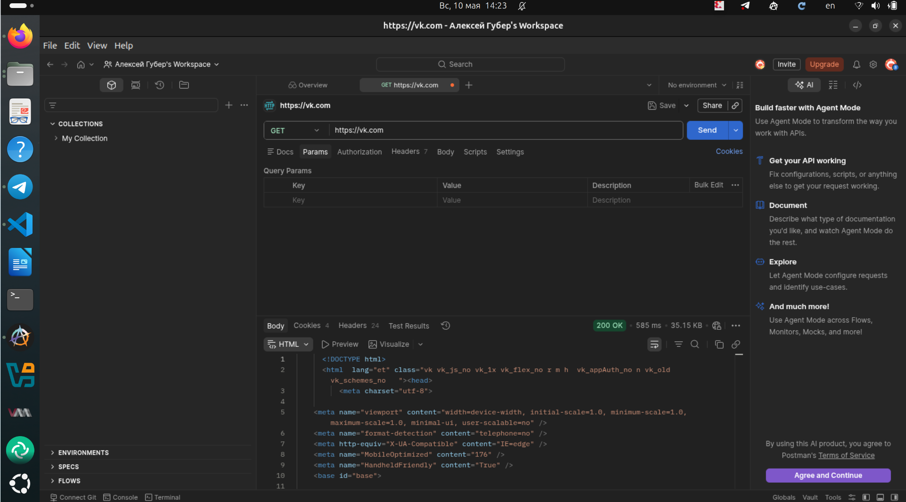
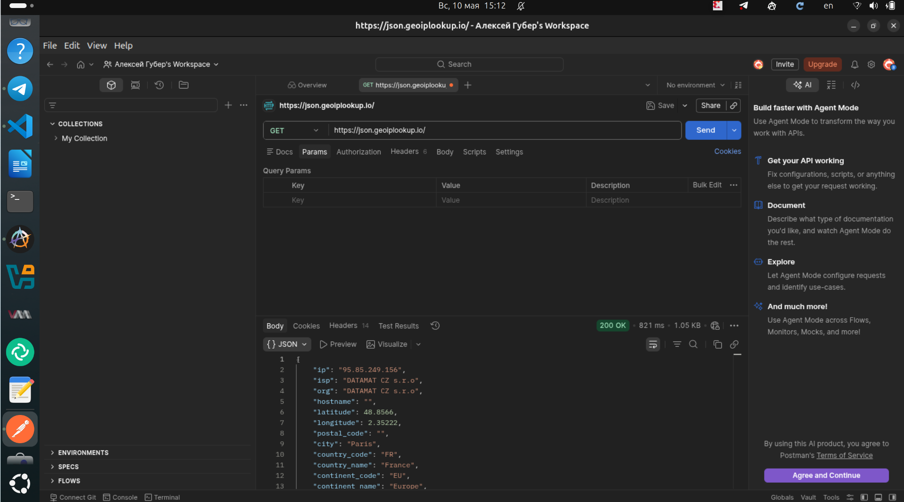
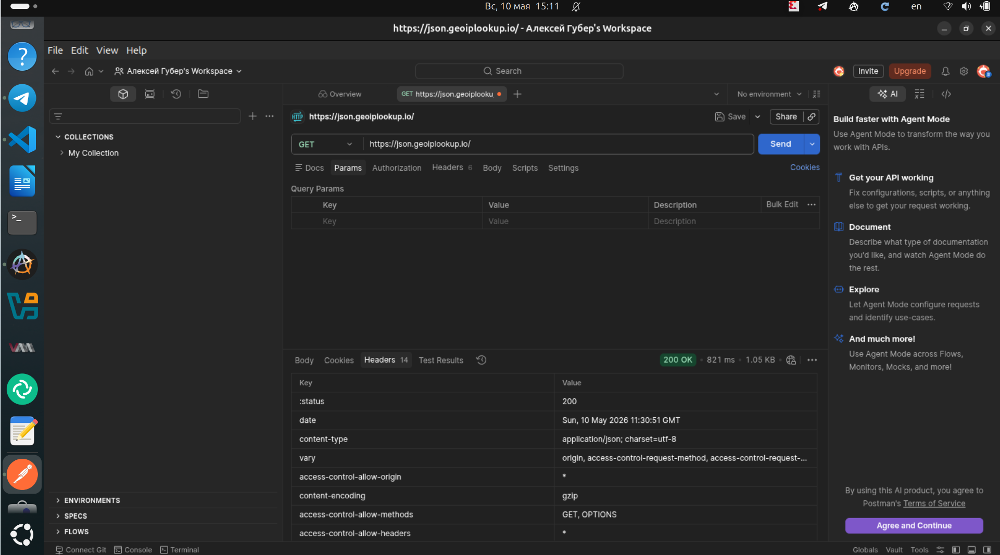
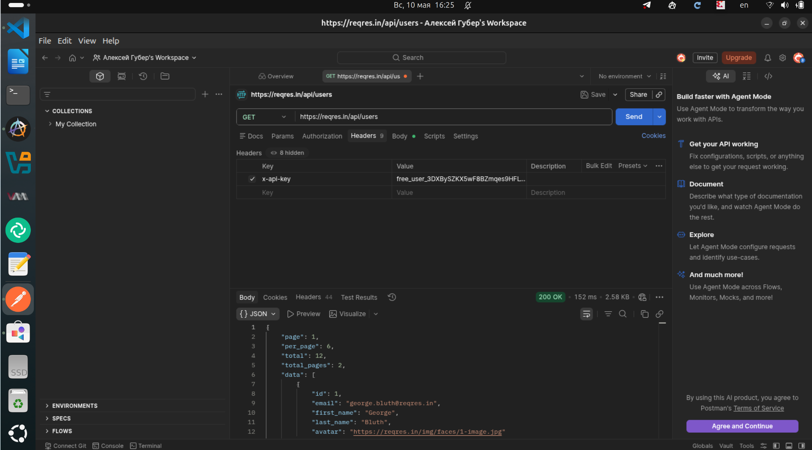
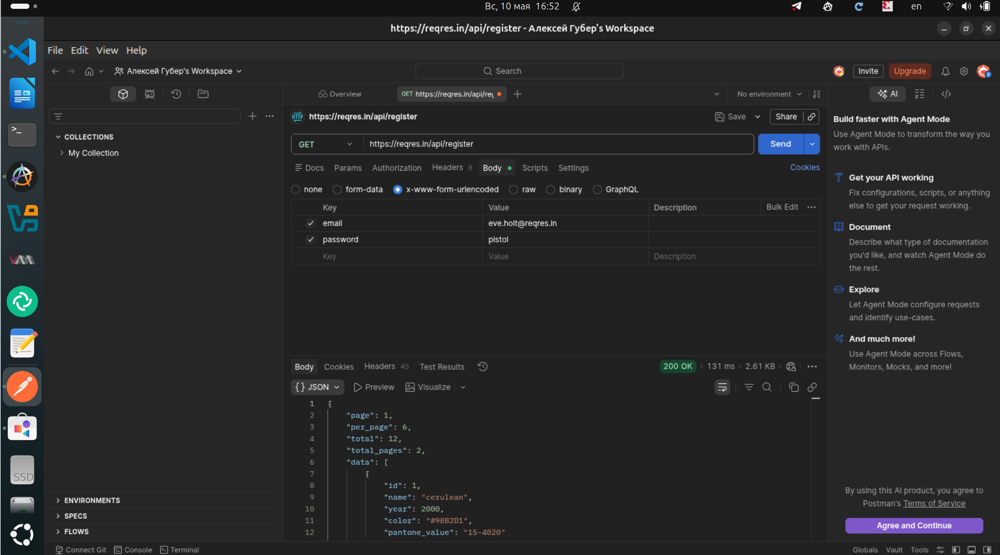
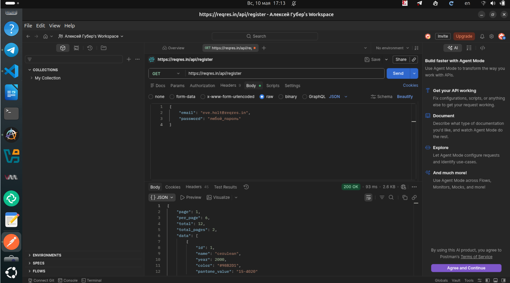

## Задание 5. GET-запросы из заданий 2 и 3

### 5.1. GET https://vk.com

В отличие от браузера, **Postman не подчиняется политике CORS**
(он не страница, а отдельное приложение), поэтому никакие
`Access-Control-Allow-Origin` ему не нужны — запрос проходит.

### 5.2. GET https://json.geoiplookup.io/

- Метод: `GET`
- URL: `https://json.geoiplookup.io/`

> *Скриншот ответа geoiplookup и его заголовков:*

---

## Задание 6. POST `https://reqres.in/api/register` (x-www-form-urlencoded)

### Список зарегистрированных пользователей
GET к `https://reqres.in/api/users`, получаем массив `data`. Там есть email которые
принимаются для регистрации.

> *Скриншот ответа /api/users:*

### POST-запрос

**Ожидаемый ответ:** `200 OK` и JSON

---

## Задание 7. POST `https://reqres.in/api/login` (JSON)

`200 OK`, JSON 

> *Скриншот вкладки Body (JSON) и ответа:*

